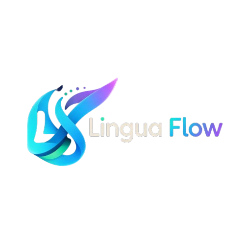

<div align="center">
  
  <h1>LinguaFlow — Plateforme E-Learning SaaS B2B Multi-Écoles</h1>
  <p><strong>Solution SaaS tout-en-un pour centres de langues (Allemand 🇩🇪 & Italien 🇮🇹)</strong></p>
  <p>
    
    
    
    
    
  </p>
</div>

---

## 🌟 Présentation

**LinguaFlow** est une plateforme e-learning SaaS multi-tenant conçue spécifiquement pour les centres de formation et écoles de langues qui enseignent **l'Allemand** et **l'Italien**.

La plateforme relie et synchronise 3 espaces utilisateurs étanches :
1. 🛡️ **Super Admin** : Supervision globale, gestion des licences, quotas d'élèves, suspensions, prolongations et journaux d'audit.
2. 🏫 **École de Langues (Directeur & Pédagogie)** : Espace en marque blanche (logo, couleurs), création de programmes CECRL (A1 -> C1), modules, leçons, quiz et suivi des élèves.
3. 🎓 **Élève (Apprenant)** : Accès sécurisé aux cours, lecteur vidéo avec filigrane dynamique anti-fuite, correcteur d'expression écrite IA (CECRL) et tuteur conversationnel immersif.

---

## 🚀 Fonctionnalités Clés

- **Support Linguistique Hybride** : Chaque école peut être configurée en **Allemand 🇩🇪**, **Italien 🇮🇹**, ou **Bilingue (les deux à la fois) 🇩🇪🇮🇹**.
- **Sécurité Multi-Tenant & RBAC Strict** : Isolation complète des données au niveau applicatif et serveur.
- **Filigrane Dynamique Anti-Piratage** : Superposition nominative (Nom élève + Nom école + Date UTC) sur le lecteur vidéo.
- **Déverrouillage Séquentiel & Calcul de Progression** : Progression en direct calculée mathématiquement par leçon validée.
- **Compteur Dynamique d'Abonnement** : Compte à rebours temps réel avec alertes visuelles progressives.
- **Assistance WhatsApp Différenciée** :
  - *École -> Super Admin* : Message pré-rempli avec identifiant école.
  - *Élève -> École* : Message pré-rempli avec niveau et nom de l'élève.
- **Internationalisation (i18n)** : Interface intégrale 100 % Français et Anglais.
- **Audit Logs Immuables** : Traçabilité détaillée de toutes les opérations administratives et pédagogiques.

---

## 🛠️ Stack Technique

- **Frontend** : React 19, TypeScript, Tailwind CSS v4, Motion (Framer Motion v12), Lucide React.
- **Backend & API** : Node.js, Express, Vite SSR Middleware, Sanity CMS Client.
- **Moteur IA** : Analyse d'expression écrite CECRL et dialogue conversationnel.
- **Build** : Vite 6 + esbuild bundle.

---

## 📦 Installation et Démarrage

### Prérequis
- Node.js >= 18
- npm >= 9

### 1. Cloner le dépôt
```bash
git clone https://github.com/Romarichirsein/Lingua-flow.git
cd Lingua-flow
```

### 2. Installer les dépendances
```bash
npm install
```

### 3. Variables d'environnement (optionnel)
Créer un fichier `.env` ou `.env.local` :
```env
GEMINI_API_KEY=votre_cle_api
PORT=3000
```

### 4. Lancer en développement
```bash
npm run dev
```

L'application est accessible sur : `http://localhost:3000`

### 5. Compiler pour la production
```bash
npm run build
npm run start
```

---

## 👤 Auteur & Propriété

- **Auteur** : Romaric Hirsein
- **Dépôt GitHub** : [https://github.com/Romarichirsein/Lingua-flow.git](https://github.com/Romarichirsein/Lingua-flow.git)
- **Version** : 2.5.0
